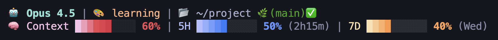
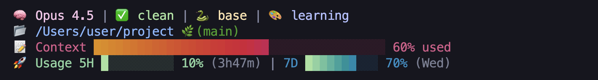

<p align="center">
  
</p>

<h1 align="center">Awesome Claude Plugins</h1>

<p align="center">
  <strong>🎨 Claude Code를 위한 아름다운 플러그인 마켓플레이스</strong>
</p>

<p align="center">
  
  
  
</p>

<p align="center">
  <a href="#-플러그인-목록">플러그인 목록</a> ·
  <a href="#-빠른-시작">빠른 시작</a> ·
  <a href="#-awesome-statusline">Awesome Statusline</a> ·
  <a href="#-마켓플레이스-명령어">마켓플레이스 명령어</a>
</p>

---

## 📦 플러그인 목록

| 플러그인 | 버전 | 설명 |
|---------|------|------|
| [**Awesome Statusline**](plugins/awesome-statusline) | v2.1.0 | Catppuccin 테마 Statusline + 실시간 API 모니터링 |

---

## 🚀 빠른 시작

### 1단계: 마켓플레이스 추가
```bash
/plugin marketplace add awesomejun/awesome-claude-plugins
```

### 2단계: 플러그인 설치
```bash
/plugin install awesome-statusline@awesome-claude-plugins
```

### 3단계: Claude Code 재시작
```bash
claude
```

---

## 🎨 Awesome Statusline

**Catppuccin 테마**가 적용된 아름다운 Statusline과 **실시간 API 사용량 모니터링**을 제공하는 플러그인입니다.

### ✨ 주요 기능

- 🎨 **4가지 디스플레이 모드**: Compact, Default, Full, Legacy
- 🌈 **Catppuccin Mocha 테마**: 아름다운 4단계 그라데이션 프로그레스 바
- 📊 **실시간 모니터링**: 모델, Git 상태, Context 사용량, API 제한 (5H/7D)
- 🔄 **간편한 모드 전환**: `/awesome-statusline-mode` 명령어
- 💾 **자동 백업**: 기존 statusline 자동 백업
- 🌟 **동적 색상**: 퍼센트 숫자가 그라데이션 끝 색상과 동일하게 변화 (Bold)

---

## 📐 디스플레이 모드

### Full 모드 (5줄, 40블록 바)

> 상세 모니터링에 적합. 비용, 시간, Git 동기화 상태까지 한눈에.

<p align="center">
  
</p>

```
🤖 Claude Opus 4.5 | 🎨 learning | 📝 +2 !1 ↑3 | 🐍 base
📂 /Users/user/project 🌿(main) | 💰 2.47$ | ⏰ 35m
🧠 Context  ██████████████████░░░░░░░░░░░░░░░░░░░░░░ 47% used (94k/200k)
🚀 5H Limit █████████████████████████░░░░░░░░░░░░░░░ 62% (Resets in 1h18m)
⭐ 7D Limit ██████████████░░░░░░░░░░░░░░░░░░░░░░░░░░ 35% (Resets Wed at 3pm)
```

<details>
<summary>📌 Full 모드 상세 설명</summary>

| 항목 | 표시 | 의미 |
|------|------|------|
| `📝 +2 !1` | Git 상태 | 2개 staged, 1개 modified |
| `↑3` | Ahead | 3커밋 push 필요 |
| `🐍 base` | Conda | 활성화된 환경 |
| `💰 2.47$` | 비용 | 세션 누적 비용 |
| `⏰ 35m` | 시간 | 세션 경과 시간 |
| `94k/200k` | 토큰 | 현재/최대 컨텍스트 |

</details>

---

### Default 모드 (2줄, 10블록 바)

> 균형 잡힌 정보량. 일반적인 사용에 적합.

<p align="center">
  
</p>

```
🤖 Claude Opus 4.5 | 🎨 learning | 📂 ~/my-project 🌿(feature/auth)✅
🧠 Context ████░░░░░░ 38% | 5H █████████░ 89% (12m) | 7D ███░░░░░░░ 28% (Fri)
```

<details>
<summary>📌 Default 모드 상세 설명</summary>

| 항목 | 표시 | 의미 |
|------|------|------|
| `✅` | Git 상태 | clean (변경 없음) |
| `38%` | Context | 컨텍스트 사용률 |
| `89%` | 5H | ⚠️ 5시간 제한 임박! |
| `(12m)` | 리셋 | 12분 후 5H 리셋 |
| `(Fri)` | 7D 리셋 | 금요일에 리셋 |

</details>

---

### Compact 모드 (2줄, 10블록 바)

> 최소한의 정보. 좁은 터미널에 적합.

<p align="center">
  
</p>

```
🤖Opus 📂~/project 🌿(main)📝
🧠████░░░░░░ 5H██████░░░░ 7D█░░░░░░░░░
```

<details>
<summary>📌 Compact 모드 상세 설명</summary>

| 항목 | 표시 | 의미 |
|------|------|------|
| `Opus` | 모델 | 축약 표시 |
| `📝` | Git | dirty (변경 있음) |
| 바만 표시 | 사용량 | % 숫자 없이 시각화만 |

</details>

---

### Legacy 모드 (4줄, 클래식 디자인)

> 1.0.2 버전의 심플한 디자인.

<p align="center">
  
</p>

```
🧠 Claude Sonnet 4 | ✅ clean | 🐍 dev | 🎨 explanatory
📂 /Users/user/web-app 🌿(develop)
📝 Context ██████████████████████████████░░░░░░░░░░ 73% used
🚀 Usage 5H ██████░░░░ 55% (2h31m) | 7D █████░░░░░ 48% (Mon)
```

<details>
<summary>📌 Legacy 모드 상세 설명</summary>

| 항목 | 표시 | 의미 |
|------|------|------|
| `Sonnet 4` | 모델 | 다른 모델 예시 |
| `🎨 explanatory` | 스타일 | Output Style |
| `73%` | Context | 컨텍스트 사용률 |
| `(2h31m)` | 5H 리셋 | 2시간 31분 후 |
| `(Mon)` | 7D 리셋 | 월요일에 리셋 |

</details>

---

## 📊 모드 비교

| 기능 | Compact | Default | Full | Legacy |
|------|---------|---------|------|--------|
| 줄 수 | 2 | 2 | 5 | 4 |
| 바 너비 | 10블록 | 10블록 | 40블록 | 40블록 |
| 모델명 | 축약 (Opus) | 전체 (Opus 4.5) | 전체 | 전체 |
| Output Style | ❌ | ✅ | ✅ | ✅ |
| Git 상태 | 아이콘만 | 아이콘만 | 상세 | 심플 |
| Git ↑↓ (ahead/behind) | ❌ | ❌ | ✅ | ❌ |
| Conda 환경 | ❌ | ❌ | ✅ | ✅ |
| 비용 | ❌ | ❌ | ✅ | ❌ |
| 세션 시간 | ❌ | ❌ | ✅ | ❌ |
| 리셋 시간 | ❌ | 축약 (1h2m) | 전체 | 축약 |
| % Bold+그라데이션 | ❌ | ✅ | ✅ | ✅ |

---

## 🌈 그라데이션 색상

### 2.1.0 모드 (Compact, Default, Full)

사용량에 따라 4단계로 색상이 변화합니다:

| 바 | 0-40% | 40-80% | 80-100% |
|-----|-------|--------|---------|
| **Context** | Mocha Maroon | Latte Maroon | 🔴 Latte Red |
| **5H Limit** | Mocha Lavender | Latte Blue | 🔴 Latte Red |
| **7D Limit** | Mocha Yellow | Latte Green | 🔴 Latte Red |

> ⚠️ **80% 이상이면 빨간색 경고!** 사용량 관리에 즉각적인 피드백 제공

### 1.0.2 Legacy

| 바 | 0-50% | 50-100% |
|-----|-------|---------|
| **Context** | Latte Yellow | Latte Red → Mauve |
| **Usage (5H/7D)** | Mocha Green | Latte Teal → Blue |

---

## 🔧 명령어

### `/awesome-statusline-start` — 설치 마법사

| 명령어 | 설명 |
|--------|------|
| `/awesome-statusline-start` | 대화형 설치 (버전 → 모드 → 설치방식) |
| `/awesome-statusline-start compact` | Compact 모드 즉시 설치 |
| `/awesome-statusline-start default` | Default 모드 즉시 설치 |
| `/awesome-statusline-start full` | Full 모드 즉시 설치 |
| `/awesome-statusline-start legacy` | Legacy 1.0.2 즉시 설치 |
| `/awesome-statusline-start restore` | 백업에서 복원 |

### `/awesome-statusline-mode` — 모드 변경

| 명령어 | 설명 |
|--------|------|
| `/awesome-statusline-mode` | 대화형 모드 선택 |
| `/awesome-statusline-mode compact` | Compact로 변경 |
| `/awesome-statusline-mode default` | Default로 변경 |
| `/awesome-statusline-mode full` | Full로 변경 |
| `/awesome-statusline-mode legacy` | Legacy로 변경 |
| `/awesome-statusline-mode restore` | 백업에서 복원 |

---

## 📦 마켓플레이스 명령어

```bash
# 마켓플레이스 추가
/plugin marketplace add awesomejun/awesome-claude-plugins

# 플러그인 설치
/plugin install awesome-statusline@awesome-claude-plugins

# 플러그인 목록 보기
/plugin marketplace list

# 마켓플레이스 업데이트
/plugin marketplace update awesome-claude-plugins

# 마켓플레이스 제거
/plugin marketplace remove awesome-claude-plugins
```

---

## ⚙️ 요구 사항

| 항목 | 설명 |
|------|------|
| **Claude Code CLI** | 최신 버전 권장 |
| **macOS** | Keychain을 통한 OAuth 토큰 접근 |
| **jq** | JSON 파싱 (`brew install jq`) |

---

## 🛠️ 플러그인 개발자용

이 마켓플레이스에 플러그인을 추가하고 싶으신가요?

1. 이 저장소를 Fork
2. `plugins/` 디렉토리에 플러그인 추가
3. `.claude-plugin/marketplace.json`에 플러그인 정보 추가
4. Pull Request 제출

---

## 📄 라이선스

MIT License — 자유롭게 사용하고 기여해주세요!

---

<p align="center">
  Made with 💜 by <a href="https://github.com/awesomejun">@awesomejun</a>
</p>

<p align="center">
  <sub>Powered by <a href="https://github.com/catppuccin/catppuccin">Catppuccin</a> 🐱</sub>
</p>
